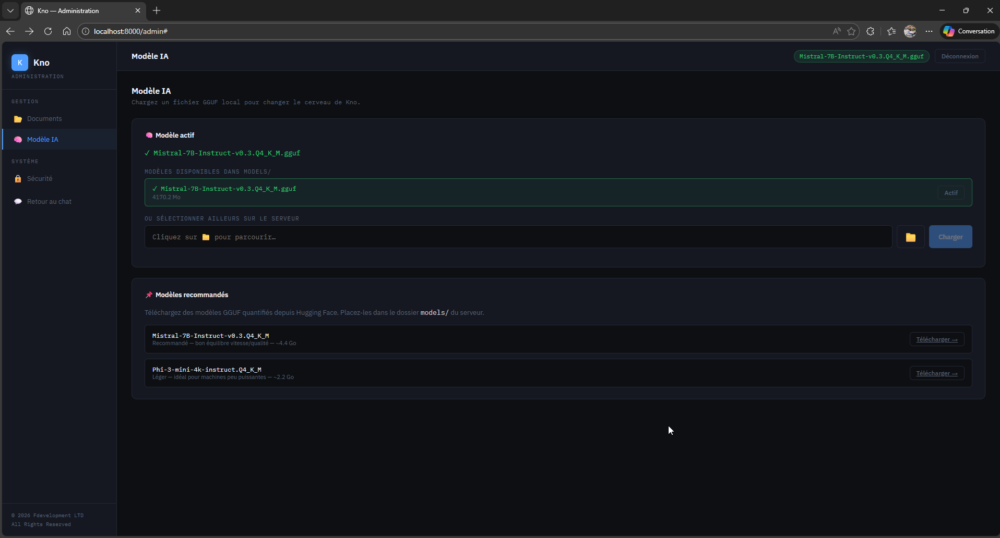
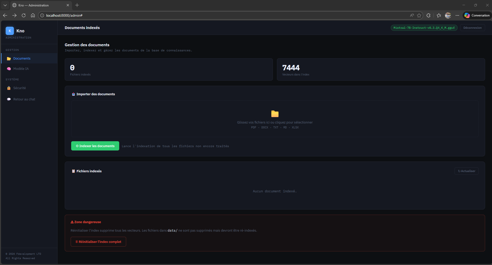

# Kno — Local AI Document Assistant

> **Your AI. Your documents. Your server.**

[](LICENSE)
[]()
[]()

*[Français](#français) · [English](#english)*

---

<a name="english"></a>
## What is Kno?

**Kno** is an intelligent document assistant that runs **entirely on your machine**. Ask questions in natural language about your PDF, Word, Excel, Markdown and text files — without sending a single byte to the cloud.

```
You : "What is the termination clause in my contract with Dupont SAS?"
Kno : "According to article 12.3 of the contract (contrat_dupont_2024.pdf),
       termination requires 90 days written notice by registered mail."
       📎 Source: contrat_dupont_2024.pdf · page 7
```

---

## Why Kno?

| Problem | Kno's Solution |
|---|---|
| ChatGPT reads your confidential documents | Everything stays on your server |
| Cloud solutions cost €20–200/month | One-time license, no subscription |
| Open-source RAG stacks are complex to deploy | Single `.exe`, zero configuration |
| Medical, legal, HR sensitive data at risk | GDPR compliant by design |

---

## Features

- **Local RAG** — Retrieval-Augmented Generation on your own documents, sources cited
- **Web interface** — Accessible from any browser on the local network
- **Multi-format** — PDF, DOCX, TXT, MD, XLSX
- **Admin panel** — Document management, AI model selection, security settings
- **GGUF models** — Compatible with all llama.cpp models (Mistral, Phi, LLaMA…)
- **Multi-user** — One server, multiple simultaneous users
- **100% offline** — Works without internet after installation

---

## Screenshots

| Chat Interface | Administration | Document Management |
|---|---|---|
|  |  |  |

---

## Quick Start

### Requirements
- Windows 10/11 64-bit (Linux coming soon)
- 8 GB RAM minimum (16 GB recommended for Mistral 7B)
- 6 GB disk space

### 3 Steps

**1. Download** Kno from the [Releases](https://github.com/kno-by-Fdevelopment-LTD/kno/releases) page

**2. Place your GGUF model** in the `models/` folder
```
kno/
├── kno.exe
├── models/
│   └── Mistral-7B-Instruct-v0.3.Q4_K_M.gguf
└── ...
```

**3. Run `kno.exe`** — browser opens automatically at `http://localhost:8000`

Admin panel: `http://localhost:8000/admin` (password configurable in `config.json`)

---

## Recommended Models

| Model | Size | RAM | Quality |
|---|---|---|---|
| [Mistral-7B-Instruct-v0.3.Q4_K_M](https://huggingface.co/bartowski/Mistral-7B-Instruct-v0.3-GGUF) | 4.4 GB | 8 GB | ⭐⭐⭐⭐⭐ Recommended |
| [Phi-3-mini-4k-instruct.Q4_K_M](https://huggingface.co/microsoft/Phi-3-mini-4k-instruct-gguf) | 2.2 GB | 6 GB | ⭐⭐⭐⭐ Lightweight |
| [LLaMA-3.1-8B-Instruct.Q4_K_M](https://huggingface.co/bartowski/Meta-Llama-3.1-8B-Instruct-GGUF) | 4.9 GB | 10 GB | ⭐⭐⭐⭐⭐ Excellent |

---

## Pricing

| License | Price | Duration | Users | Concurrent sessions |
|---|---|---|---|---|
| **Solo** | €39 | 5-year perpetual | 1 | 5 |
| **Student** | €19 | 5-year perpetual | 1 | 5 |
| **Pro** | €149/year | Annual | Up to 5 | 50 |
| **Business** | €499/year | Annual | Unlimited (1 site) | Unlimited |
| **Enterprise** | On quote | Custom | Multi-site | Custom |

[→ Purchase a license](https://kno.fdevelopment.eu)

> 💼 **Specific needs?** Custom deployment, multi-site installation, volume pricing, dedicated SLA or custom integration?  
> Send your requirements to **contact@fdevelopment.eu** and we'll get back to you within 48 hours.

---

## Security & Privacy

- **100% local** — No telemetry, no outbound network calls
- **Admin authentication** — Password-protected admin interface with session tokens
- **LAN only** — Not exposed to internet by default
- **GDPR by design** — No data leaves your infrastructure, ever
- **Ideal for** — Medical, legal, HR, financial and R&D sensitive documents

---

## Architecture

```
kno.exe (PyInstaller)
├── FastAPI + Uvicorn          (web server)
├── LangChain + FAISS          (RAG pipeline)
├── llama-cpp-python           (local LLM inference)
├── fastembed / ONNX Runtime   (embeddings, no PyTorch)
└── HTML/JS web interface      (UI)
```
## 🐛 Report a bug or suggestion

Go to the [Issues](https://github.com/kno-by-Fdevelopment-LTD/kno/issues) page of the GitHub repository and click **New issue**.

Please include:
- Your Kno version (e.g. v1.0.0)
- Your OS (Windows 10 / 11)
- What you did and what happened
- The console output if it's a bug

For commercial inquiries or license activation: **contact@fdevelopment.eu**

---

<a name="français"></a>
## Français

**Kno** est un assistant de gestion documentaire qui tourne entièrement sur votre machine. Posez des questions en langage naturel sur vos documents — sans cloud, sans abonnement.

### Installation

1. Téléchargez depuis la page [Releases](https://github.com/kno-by-Fdevelopment-LTD/kno/releases)
2. Placez votre modèle GGUF dans `models/`
3. Lancez `kno.exe` → `http://localhost:8000`

### Tarifs

| Licence | Prix | Durée | Utilisateurs | Sessions simultanées |
|---|---|---|---|---|
| Solo | 39 € | Perpétuelle 5 ans | 1 | 5 |
| Étudiant | 19 € | Perpétuelle 5 ans | 1 | 5 |
| Pro | 149 €/an | Annuelle | 5 | 50 |
| Business | 499 €/an | Annuelle | Illimité | Illimitées |
| Enterprise | Sur devis | Sur mesure | Multi-sites | Sur mesure |

[→ Acheter](https://kno.fdevelopment.eu) · [→ Documentation complète](docs/)

> 💼 **Besoins spécifiques ?** Déploiement multi-sites, intégration personnalisée, tarif volume, SLA dédié ?  
> Envoyez votre demande de devis à **contact@fdevelopment.eu** — réponse sous 48h.

---

## License

Kno is commercial proprietary software.  
© 2026 Fdevelopment LTD — All rights reserved.  
See [LICENSE](LICENSE) for full terms.

---

## 🐛 Signaler un bug ou une suggestion

Rendez-vous sur la page [Issues](https://github.com/kno-by-Fdevelopment-LTD/kno/issues) du dépôt GitHub et cliquez sur **New issue**.

Précisez :
- Votre version de Kno (ex : v1.0.0)
- Le système (Windows 10 / 11)
- Ce que vous avez fait et ce qui s'est passé
- Le contenu de la console si c'est un bug

Pour toute question commerciale ou activation de licence : **contact@fdevelopment.eu**

---

## Contact

**Website**: [fdevelopment.ltd](https://fdevelopment.ltd) · **Email**: contact@fdevelopment.ltd
